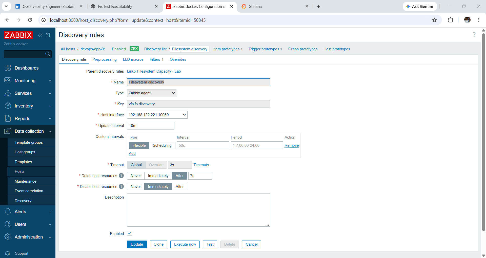
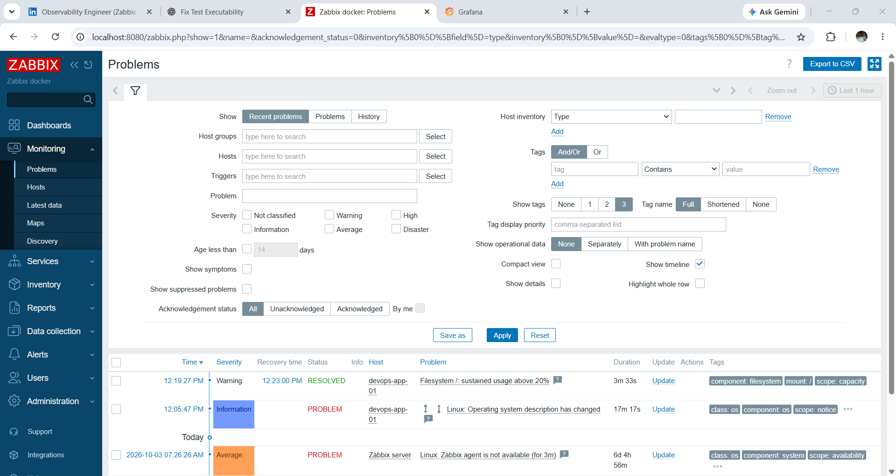
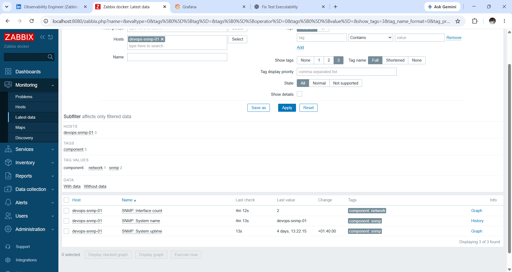
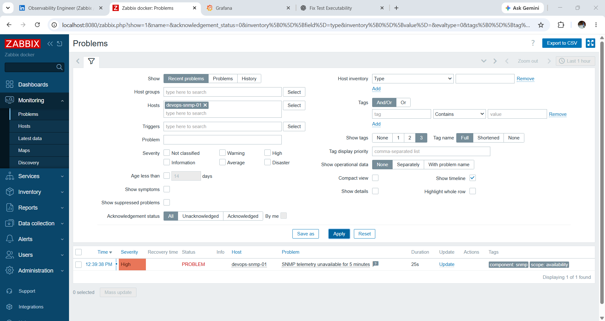
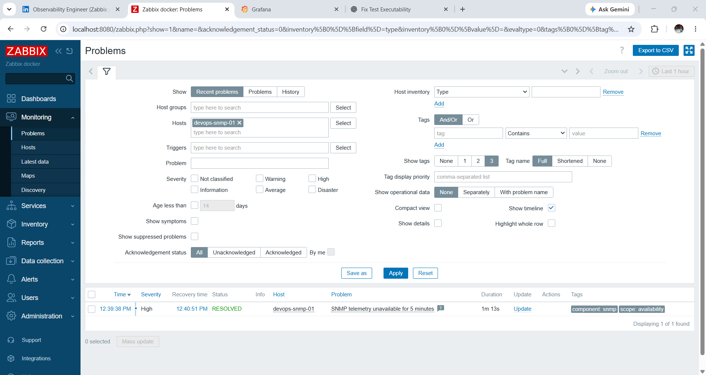
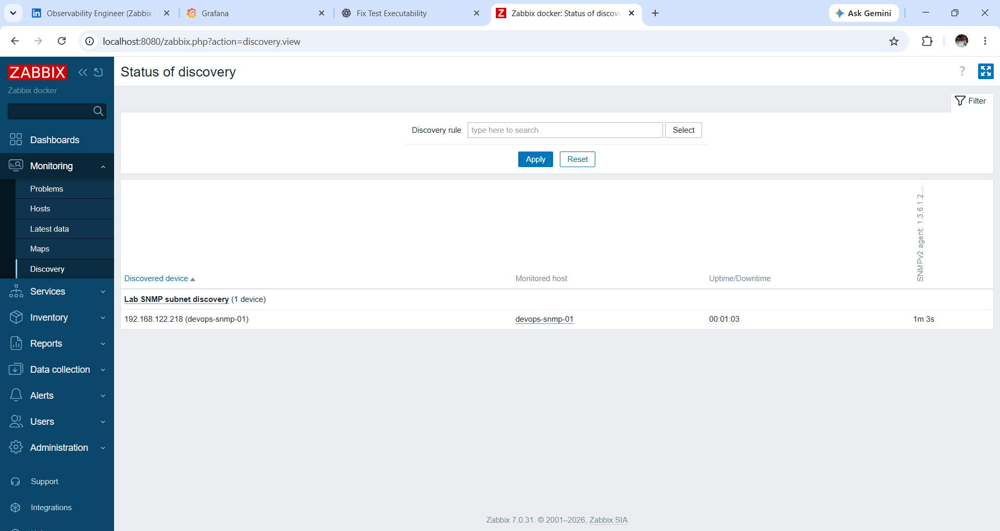
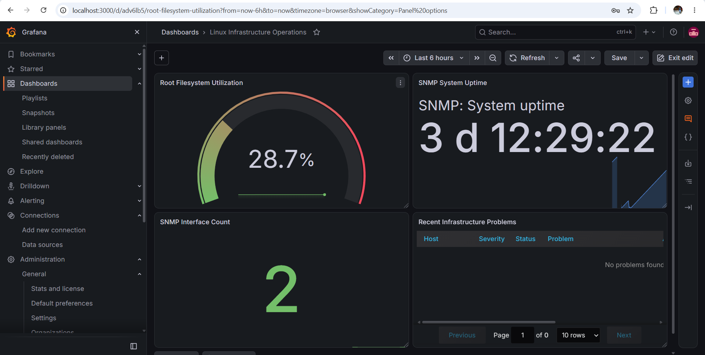
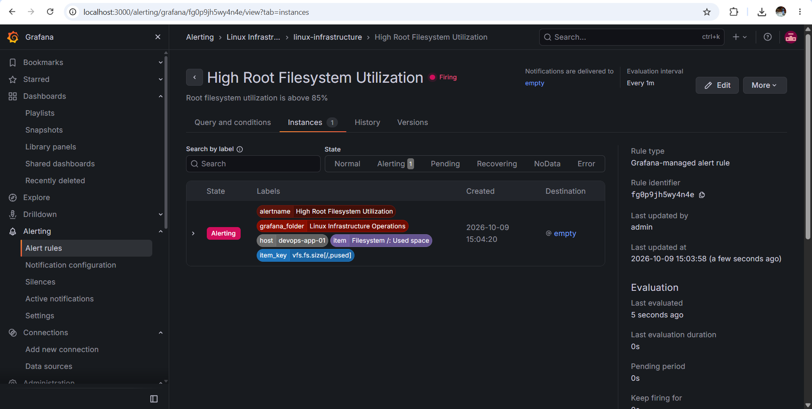
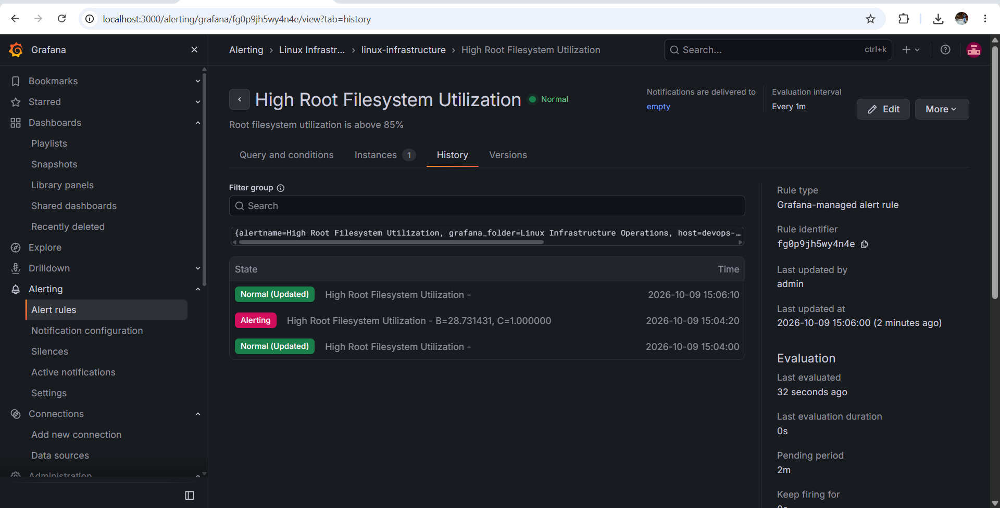

# Observability Expansion

This extension adds reusable Zabbix monitoring, SNMP telemetry, network discovery, alert tuning, and a Grafana operations dashboard to the existing Linux DevOps Operations Lab.

## Goal

The objective was to move the lab from basic service monitoring toward infrastructure-observability work that can be inspected, reused, and explained:

- build a custom Zabbix template instead of relying only on built-in templates
- use low-level discovery and prototypes
- tune alert conditions to reduce transient noise
- monitor a separate Linux node over SNMP
- detect loss of SNMP telemetry and verify automatic recovery
- discover the SNMP node through Zabbix network discovery
- visualize Zabbix data in Grafana
- validate a Grafana-managed alert lifecycle
- remove monitoring noise that does not represent an actionable condition

## Topology

```text
WSL2 / Ansible control
        |
        +---------------- SSH ----------------+
        |                                     |
        v                                     v
devops-app-01                         devops-monitor-01
Zabbix agent                          Docker Compose
FastAPI + Nginx                       PostgreSQL
Docker                                Zabbix Server/Web
                                      Grafana
                                           |
                                           | SNMPv2 UDP/161
                                           v
                                    devops-snmp-01
                                    snmpd
```

## 1. Custom filesystem-capacity template

File:

[`monitoring/zabbix/templates/template-linux-filesystem-capacity.yaml`](../monitoring/zabbix/templates/template-linux-filesystem-capacity.yaml)

The template demonstrates:

- **LLD rule:** `vfs.fs.discovery`
- filesystem-type filtering for ext2/ext3/ext4/xfs
- **item prototype:** `vfs.fs.size[{#FSNAME},pused]`
- **macro:** `{$FS.PUSED.WARN}`
- **trigger prototype:** sustained usage above the threshold for 10 minutes
- tags for component, mount, and capacity scope

The 10-minute minimum condition is intentional. It demonstrates an alert-quality decision: short filesystem spikes should not page an operator if capacity immediately returns to normal.

During validation, the host-level macro was temporarily lowered to force the warning, then returned to the normal operating threshold after recovery was confirmed.





## 2. Dedicated SNMP target

A third VM, `devops-snmp-01`, was added as an isolated monitoring target.

Ansible role:

[`ansible/roles/snmp_target/`](../ansible/roles/snmp_target/)

The role:

- validates that a non-default lab community string is provided
- installs `snmpd` and SNMP client tools
- deploys a restricted read-only `snmpd.conf`
- limits the community to the monitoring host
- enables and starts `snmpd`
- verifies UDP/161 is listening

The community value comes from:

```bash
export SNMP_COMMUNITY='replace-with-a-non-default-lab-value'
```

The actual community string is not committed.

## 3. SNMP Zabbix template

File:

[`monitoring/zabbix/templates/template-snmp-linux-lab.yaml`](../monitoring/zabbix/templates/template-snmp-linux-lab.yaml)

Collected OIDs:

| Signal | OID | Zabbix item |
|---|---|---|
| System name | `1.3.6.1.2.1.1.5.0` | `SNMP: System name` |
| System uptime | `1.3.6.1.2.1.1.3.0` | `SNMP: System uptime` |
| Interface count | `1.3.6.1.2.1.2.1.0` | `SNMP: Interface count` |

The uptime item includes a HIGH-severity `nodata(...,5m)` trigger. A single missed poll is therefore not enough to raise the incident; sustained loss of telemetry is required.



## 4. SNMP outage and recovery drill

The SNMP service was intentionally interrupted to simulate loss of monitoring visibility.

Expected behavior:

```text
snmpd unavailable
      |
      v
Zabbix receives no uptime data
      |
      v
5-minute no-data condition
      |
      v
HIGH problem: SNMP telemetry unavailable
      |
      v
snmpd restored
      |
      v
fresh telemetry received
      |
      v
problem automatically resolves
```

Evidence:





## 5. Network discovery and onboarding

Zabbix network discovery was configured against the isolated lab subnet with an SNMPv2 check.

The discovery workflow verified that `devops-snmp-01` could be found by its SNMP service. A discovery action named `Auto-onboard SNMP lab devices` was configured to:

- match the lab SNMP discovery rule
- require discovery status `Up`
- require SNMPv2 service
- add the device to the `Linux servers` host group
- link the custom `SNMP Linux Node - Lab` template



## 6. Grafana integration

Grafana was connected to the Zabbix API using the Zabbix data-source plugin.

Authentication uses a **dedicated Zabbix API token**. The token is stored only in Grafana's data-source configuration and is not committed to Git.

Dashboard:

`Linux Infrastructure Operations`

Panels:

- Root Filesystem Utilization
- SNMP System Uptime
- SNMP Interface Count
- Recent Infrastructure Problems



## 7. Grafana-managed alerting

A Grafana-managed rule named `High Root Filesystem Utilization` was created against the Zabbix-backed `Filesystem /: Used space` metric for `devops-app-01`.

Normal rule configuration:

| Setting | Value |
|---|---|
| Evaluation interval | 1 minute |
| Threshold | above 85% |
| Pending period | 2 minutes |
| Keep firing for | 0 seconds |

The alert description is:

`Root filesystem utilization is above 85%`

For safe validation, the filesystem itself was **not** artificially filled. Instead, the rule threshold was temporarily lowered from **85% to 20%** and the pending period from **2m to 0s**. With root filesystem utilization at approximately **28.7%**, Grafana evaluated the condition as true and entered the `Firing` state.



Immediately after validation, the operational values were restored to **85%** and **2m**. The next evaluations returned the rule to `Normal`. Grafana's history records the lifecycle:

```text
Normal -> Alerting -> Normal
```



The contact point used in this isolated lab has no external integration configured. Notification delivery was intentionally left out of scope; the objective was to demonstrate Grafana-native rule evaluation, alert state transitions, and recovery.

## 8. Alert-noise cleanup

The initial Zabbix configuration included a `Linux by Zabbix agent` template on the containerized `Zabbix server` host even though no corresponding host agent was intended for that object.

That produced a persistent non-actionable agent-unavailable problem.

The cleanup was:

- unlink and clear `Linux by Zabbix agent` from the `Zabbix server` host
- retain `Zabbix server health`
- filter the operations dashboard toward actionable severities instead of low-value informational events

This leaves the healthy dashboard with no active infrastructure problems while preserving historical failure/recovery evidence separately.

## Validation commands

Examples used during the lab:

```bash
ansible snmp_targets -i inventory.ini -m ping

ansible-playbook -i inventory.ini site.yml --limit snmp_targets

snmpget -v2c -c "$SNMP_COMMUNITY" <SNMP_TARGET_IP> 1.3.6.1.2.1.1.5.0

snmpwalk -v2c -c "$SNMP_COMMUNITY" <SNMP_TARGET_IP> 1.3.6.1.2.1.2.2.1.2

curl http://<MONITOR_VM_IP>:8080/api_jsonrpc.php
```

## Evidence index

| File | Demonstrates |
|---|---|
| `01-zabbix-filesystem-lld-cropped.png` | custom filesystem discovery/prototype configuration |
| `02-zabbix-filesystem-alert-recovery-cropped.png` | threshold alert and recovery |
| `03-zabbix-snmp-live-data-cropped.png` | SNMP metrics collected in Zabbix |
| `04-zabbix-snmp-outage-alert-cropped.png` | sustained SNMP telemetry failure |
| `05-zabbix-snmp-recovery-cropped.png` | automatic recovery after service restoration |
| `06-zabbix-network-discovery-cropped.png` | SNMP target discovered on the lab subnet |
| `07-grafana-infrastructure-dashboard-cropped.png` | final Grafana/Zabbix operations view |
| `08-grafana-native-alert-firing.png` | Grafana-managed filesystem alert in firing state |
| `09-grafana-native-alert-recovery-history.png` | Grafana alert lifecycle showing Normal → Alerting → Normal |

## Scope

This work is intentionally an isolated lab. The objective is to demonstrate the mechanics and troubleshooting workflow around Zabbix, Grafana, SNMP, Linux, and alerting without presenting the environment as production infrastructure.
